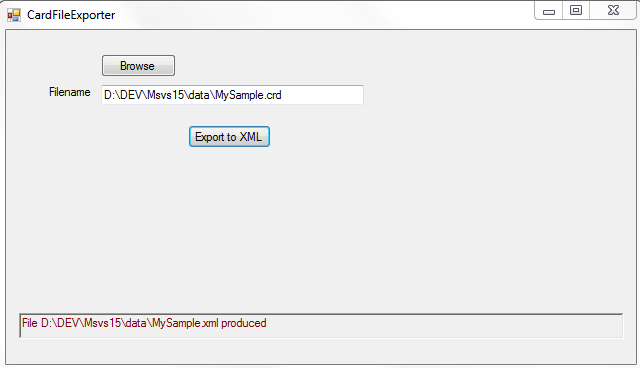

## CardFileExporter

Exports a Microsoft Cardfile to XML.

The MS Cardfile ([Cardfile](http://wikivisually.com/wiki/Cardfile)) is an old app from Windows NT and previous versions, however some still use Cardfile today.  The app was bundled in with the OS, and provided a simple GUI and 'database' in the manner of a manual indexed card file.  The MS app did not provide a means of exporting the data held within it.

This uses the [CardFileRdr](http://github.com/antboy/CardFileRdr) library.

A limitation of the CardFileRdr is that it ignores contained OLEs and graphic objects such as bitmaps, which are theoretically allowed, so reads only the text contents, but it will process Unicode correctly.

## Installation
Simply download CardFileExporter.exe from the repository Release area, and place into a local directory of your choice.  Run the .exe file as normal, with no parameters.

The SHA-256 hash of the file is:
6e3fdb1b2535f5fa8092a3c568d579131fcf3b7135b653d558a05c40a24162e5

## Usage

Run the .exe, click the Browse button to select the cardfile to export, then press Export to XML.  The output file will be produced in the same directory as the input cardfile and will have the same file name but with an .xml extension.  This is confirmed in the status bar at the bottom of the app.

